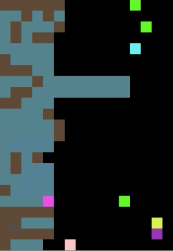

[](https://travis-ci.com/eugenevinitsky/sequential_social_dilemma_games)

# Sequential Social Dilemma Games
This repo is an open-source implementation of DeepMind's Sequential Social Dilemma (SSD) multi-agent game-theoretic environments [[1]](https://arxiv.org/abs/1702.03037). SSDs can be thought of as analogous to spatially and temporally extended Prisoner's Dilemma-like games. The reward structure poses a dilemma because individual short-term optimal strategies lead to poor long-term outcomes for the group.

The implemented environments are structured to be compatible with [OpenAIs gym environments](https://github.com/openai/gym) as well as [RLlib's Multiagent Environment](https://github.com/ray-project/ray/blob/master/rllib/env/multi_agent_env.pyhttps://github.com/ray-project/ray/blob/master/python/ray/rllib/env/multi_agent_env.py)

## Implemented Games

* **Cleanup**: A public goods dilemma in which agents get a reward for consuming apples, but must use a cleaning beam to clean a river in order for apples to grow. While an agent is cleaning the river, other agents can exploit it by consuming the apples that appear.



* **Harvest**: A tragedy-of-the-commons dilemma in which apples regrow at a rate that depends on the amount of nearby apples. If individual agents employ an exploitative strategy by greedily consuming too many apples, the collective reward of all agents is reduced.


The above plot shows the empirical Schelling diagrams for both Cleanup (A) and Harvest (B) (from [[2]](https://arxiv.org/abs/1803.08884)). These diagrams show the payoff that an individual agent can expect if it follows a defecting/exploitative strategy (red) vs a cooperative strategy (blue), given the number of other agents that are cooperating.  We can see that an individual agent can almost always greedily benefit from detecting, but the more agents that defect, the worse the outcomes for all agents.  

# Setup instructions
```
git clone -b master https://github.com/eugenevinitsky/sequential_social_dilemma_games
cd sequential_social_dilemma_games
python3 -m venv venv # Create a Python virtual environment
. venv/bin/activate
pip3 install --upgrade pip setuptools wheel
python3 setup.py develop
pip3 install -r requirements.txt
# Patch ray due to https://github.com/ray-project/ray/issues/7946
# And https://github.com/ray-project/ray/pull/8491
. ray_uint8_patch.sh 
cd run_scripts
```

After the setup, you can run experiments like so:
- To train with default parameters (baseline model cleanup with 2 agents):
`python3 train.py`

- To train the MOA with 5 agents:
`python3 train.py --model moa --num_agents 5`

Many more options are available which can be found in [default_args.py](config/default_args.py). A collection of preconfigured training scripts can be found in [run_scripts](run_scripts). 

Note that the initialization time can be rather high (up to 5 minutes) the more agents you use, and the more complex your used model is.


## PPO Results

The below graphs display results for cleanup/harvest using un-tuned PPO. As of yet, A3C remains untested.

**Collective cleanup reward**:


**Collective harvest reward**:


## Custom update
dynamic_tf_policy: update dynamic_batch add 'cont_rewards'

rollout_worker: add try_steps hyperparameter

